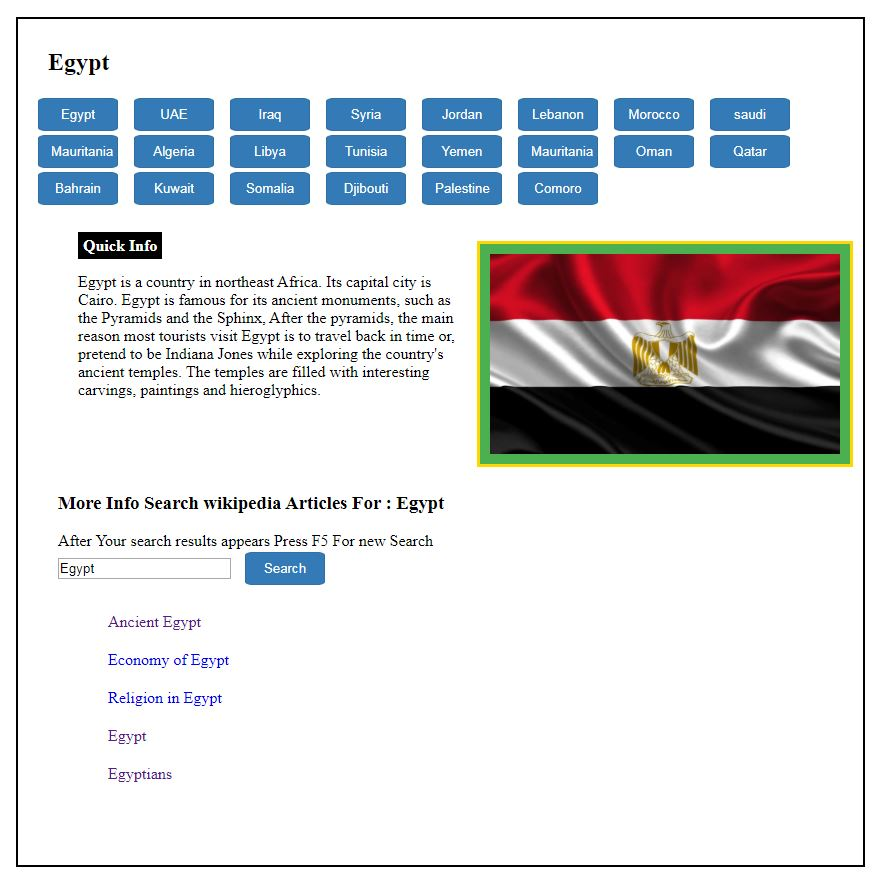

# World_Info-Applaction

1. Full responsive 
2. HTML, CSS, JavaScript, and Wikipedia API, HTML DOM, AJAX request, 
3. this application used to get info about all countries and their flags 
4. and user can search and get info about this country and next step is to 
5. add google map API to provide restaurants and hotels at each countries also
6. prices to live in hotel and cost of the currency VS dollar .
7. also I will provide images for each country on the work map , 
8. next step is to add all countries in the world in this applaction  
